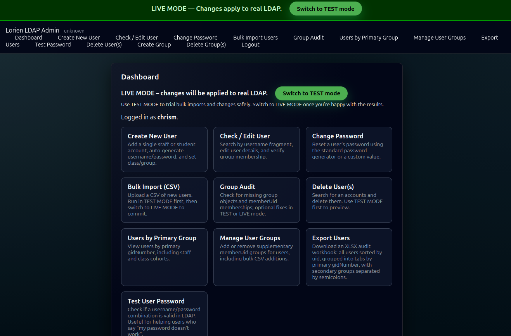
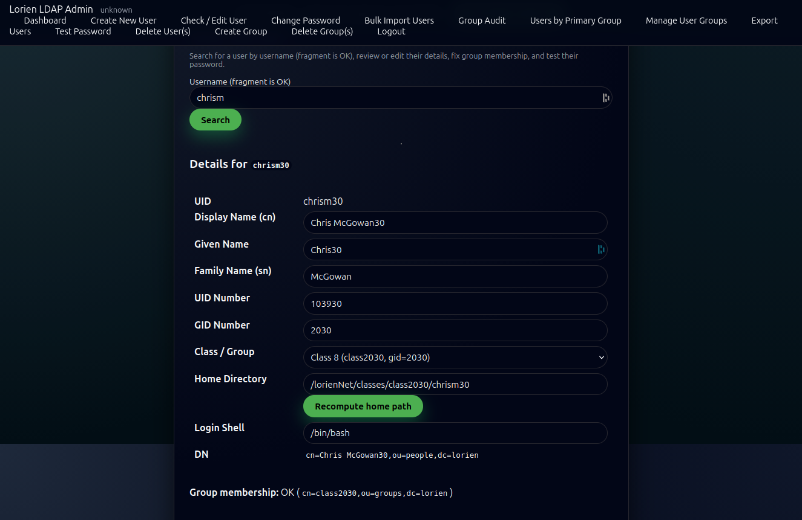
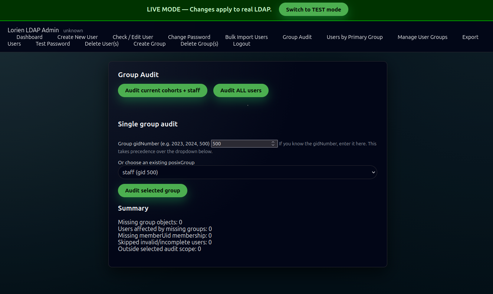
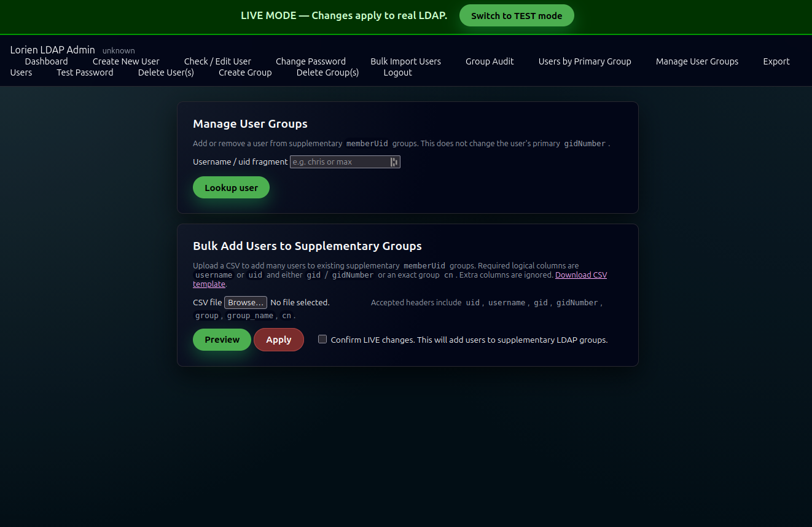

# LDAP Admin Flask Tool

A Flask-based LDAP administration tool for schools and small organisations.

This project was originally built for Lorien Novalis School in NSW, Australia, to make common OpenLDAP administration tasks safer and easier than one-off shell scripts.

## Features

- Create LDAP users.
- Check and edit user attributes.
- Change user passwords.
- Bulk import users from CSV.
- Bulk change passwords from CSV.
- Manage supplementary `memberUid` groups.
- Bulk add users to supplementary groups from CSV.
- Audit primary `gidNumber` / `posixGroup` / `memberUid` consistency.
- Export users to an XLSX spreadsheet grouped by primary group.
- Generate kid-friendly or stronger temporary passwords.
- Support different home-directory styles:
  - `classic_unix`: `/home/{username}`
  - `graduation_year_group`: school-style staff/class-year paths
- Optional generated password/export files for school environments.
- Optional Zimbra provisioning output for sites that need it.

## Screenshots

### Dashboard

The dashboard provides quick access to the main LDAP administration workflows.



### Check / Edit User

Search for users by username fragment, review LDAP attributes, update editable fields, verify group membership, and recompute home-directory paths from the configured home style.



### Group Audit

Audit primary `gidNumber`, missing `posixGroup` objects, and supplementary `memberUid` consistency before making changes.



### Manage User Groups

Add or remove supplementary groups for individual users, or bulk add group memberships from a CSV file.



### Additional screenshots

- [Create New User](docs/screenshots/ldap_new_user.png)
- [Bulk Import Users](docs/screenshots/ldap_bulk_import.png)
- [Delete Users](docs/screenshots/ldap_delete_users.png)

## Status

This project is useful, but still site-admin oriented. Read the configuration and installation notes carefully before using it against a live LDAP directory.

Start in TEST mode.

## Installation

See [INSTALL.md](INSTALL.md).

## Configuration

`config.py` is intentionally not tracked by git. Create it from one of the example files:

```bash
cp config_example.py config.py
```

or, for a school-style setup if provided:

```bash
cp config_school.py config.py
```

Then edit it for your LDAP tree, bind account, admin allowlist, classes/groups, and home-directory style.

## Security notes

This tool can create, modify, and delete LDAP users/groups. Treat it like an administrative tool.

Recommended precautions:

- Run behind HTTPS.
- Restrict access to trusted networks or VPNs.
- Use `ADMIN_UID_ALLOWLIST`.
- Use TEST mode before LIVE mode.
- Do not commit `config.py`.
- Do not commit generated password CSV files.
- Use a least-privilege LDAP bind account where practical.

## Development checks

```bash
python -m compileall -q .
ruff check .
```

GitHub Actions creates a temporary `config.py` from `config_example.py` for syntax checks.

## Licence

This project is licensed under the GNU General Public License v3.0.

See [LICENSE](LICENSE) or the GNU GPL v3.0 text:
https://www.gnu.org/licenses/gpl-3.0.en.html
